# Keep Kaam V1 ERD

Date: 2026-05-08
Scope: `Leave Management System & Project Allocation`

## Documentation Stage

- Documentation stage: `Planning complete`
- Repository stage on `2026-05-08`: `Docs-only; ERD is a planning artifact, not a reflection of implemented tables`
- Usage stage: `Ready to guide backend model design and frontend contract planning`

Source of truth:

- [.agents/keep-kaam-prd-clarification-log.md](/Users/mac/Documents/keep-kaam-training/.agents/keep-kaam-prd-clarification-log.md)
- [2026-05-08-keep-kaam-v1-final-project-brief.md](/Users/mac/Documents/keep-kaam-training/docs/superpowers/specs/2026-05-08-keep-kaam-v1-final-project-brief.md)

This document converts the approved V1 scope into a review-friendly entity relationship view. It includes:

- a conceptual ERD for high-level understanding
- a detailed ERD with key fields for implementation planning
- explanatory descriptions of each entity and relationship

Per instruction, this document does not define database constraints, indexing rules, or low-level enforcement details.

## Implementation Alignment

This ERD should be read with the following implementation direction in mind:

- backend: `Django + Django REST Framework`
- frontend: `React.js + TypeScript`

That means:

- the ERD is primarily backend-driven and should be treated as the domain/data model reference for the DRF application
- most entities in this document are strong candidates for Django models, or for model-adjacent domain records managed by the backend
- the frontend should consume these entities through DRF resources, serializers, and typed API responses rather than owning business rules itself
- React TypeScript components should treat this structure as the source for API contracts, screen state, filters, detail pages, and workflow actions

In short, this ERD is not just a conceptual business picture. It is intended to guide:

- Django app boundaries
- DRF serializer and viewset/resource design
- frontend TypeScript type modeling
- API payload relationships between screens

## Recommended Folder Placement

This ERD lives under:

- `docs/architecture/erd/`

This keeps architecture artifacts separate from:

- raw PRD material in `docs/prd/`
- finalized product brief/spec documents in `docs/superpowers/specs/`

## DRF-Oriented Reading Of The ERD

For backend implementation, the entities in this document should be understood in three groups:

### 1. Core persistent domain entities

These are the main records that will likely become first-class Django models:

- `EMPLOYEE_PROFILE`
- `CUSTOMER`
- `PROJECT`
- `PROJECT_MILESTONE`
- `PROJECT_DOCUMENT`
- `PROJECT_ASSIGNMENT`
- `LEAVE_TYPE`
- `SPECIAL_LEAVE_CATEGORY`
- `LEAVE_BALANCE_ACCOUNT`
- `LEAVE_REQUEST`
- `LEAVE_ATTACHMENT`
- `LEAVE_APPROVAL_STEP`
- `PUBLIC_HOLIDAY`
- `AUDIT_LOG`
- `NOTIFICATION`

### 2. Django-managed or framework-aligned support entities

The following concepts are still important to the system design and are intentionally shown in the ERD for full visualization, even though they may be handled by Django, DRF, or the selected auth integration layer:

- `USER_ACCOUNT`
- `OAUTH_IDENTITY`
- `AUTH_SESSION`
- `ACCESS_ROLE`
- `USER_ROLE_ASSIGNMENT`

In practice, these may map to:

- Django's built-in user model or a custom user model
- Django auth groups and permissions
- session/auth tables managed by Django
- Google OAuth or social-auth integration tables
- thin profile or access wrappers only where the domain truly needs them

Because of that, they should be treated as implementation-support concerns within the ERD, not as the center of the scoped business domain.

### 3. Event or integration-shaped records

These are still useful in the ERD, but the backend may implement them as lighter-weight models, service records, or workflow/event tables rather than classic CRUD-first resources:

- `PROJECT_INTAKE_EVENT`
- `CUSTOMER_COMMUNICATION_LOG`

This distinction matters in DRF because not every entity must become a full public `ModelViewSet`. Some records may be internal, append-only, action-driven, or exposed only through nested endpoints or reporting endpoints.

## Conceptual ERD

```mermaid
erDiagram
    USER_ACCOUNT ||--|| EMPLOYEE_PROFILE : links_to
    USER_ACCOUNT ||--o{ AUTH_SESSION : opens
    USER_ACCOUNT ||--o{ OAUTH_IDENTITY : authenticates_with
    USER_ACCOUNT ||--o{ USER_ROLE_ASSIGNMENT : receives
    USER_ACCOUNT ||--o{ USER_ROLE_ASSIGNMENT : assigns
    ACCESS_ROLE ||--o{ USER_ROLE_ASSIGNMENT : grants

    EMPLOYEE_PROFILE ||--o{ PROJECT_ASSIGNMENT : receives
    CUSTOMER ||--o{ PROJECT : owns
    PROJECT ||--o{ PROJECT_ASSIGNMENT : has
    PROJECT ||--o{ PROJECT_MILESTONE : tracks
    PROJECT ||--o{ PROJECT_DOCUMENT : stores
    CUSTOMER ||--o{ CUSTOMER_COMMUNICATION_LOG : records
    PROJECT ||--o{ CUSTOMER_COMMUNICATION_LOG : relates_to
    USER_ACCOUNT ||--o{ CUSTOMER_COMMUNICATION_LOG : records
    PROJECT_INTAKE_EVENT o|--|| PROJECT : creates

    EMPLOYEE_PROFILE ||--o{ LEAVE_REQUEST : submits
    LEAVE_TYPE ||--o{ LEAVE_REQUEST : classifies
    SPECIAL_LEAVE_CATEGORY o|--o{ LEAVE_REQUEST : refines
    LEAVE_REQUEST ||--o{ LEAVE_APPROVAL_STEP : progresses_through
    USER_ACCOUNT ||--o{ LEAVE_APPROVAL_STEP : decides
    LEAVE_REQUEST ||--o{ LEAVE_ATTACHMENT : may_have
    EMPLOYEE_PROFILE ||--o{ LEAVE_BALANCE_ACCOUNT : has
    LEAVE_TYPE ||--o{ LEAVE_BALANCE_ACCOUNT : tracks
    PUBLIC_HOLIDAY ||--o{ LEAVE_REQUEST : influences

    USER_ACCOUNT ||--o{ AUDIT_LOG : performs
    USER_ACCOUNT ||--o{ NOTIFICATION : receives
    LEAVE_REQUEST ||--o{ AUDIT_LOG : emits
    PROJECT_ASSIGNMENT ||--o{ AUDIT_LOG : emits
    PROJECT ||--o{ AUDIT_LOG : emits
    LEAVE_REQUEST ||--o{ NOTIFICATION : triggers
    PROJECT_ASSIGNMENT ||--o{ NOTIFICATION : triggers
    PROJECT ||--o{ NOTIFICATION : triggers
```



## Detailed ERD

```mermaid
erDiagram
    USER_ACCOUNT {
        string id PK
        string email
        string display_name
        string account_status
        datetime last_login_at
    }

    OAUTH_IDENTITY {
        string id PK
        string user_account_id FK
        string provider
        string provider_subject
        string provider_email
        datetime linked_at
    }

    AUTH_SESSION {
        string id PK
        string user_account_id FK
        datetime started_at
        datetime expires_at
        datetime revoked_at
        string session_status
    }

    ACCESS_ROLE {
        string id PK
        string role_name
        string role_group
        string description
    }

    USER_ROLE_ASSIGNMENT {
        string __JUNCTION_TABLE__: USER_ACCOUNT <-> ACCESS_ROLE
        string __M2M_BRIDGE__: USER_ACCOUNT <-> ACCESS_ROLE
        string id PK
        string user_account_id FK
        string access_role_id FK
        datetime assigned_at
        datetime ended_at
        string assigned_by_user_id FK
    }

    EMPLOYEE_PROFILE {
        string id PK
        string user_account_id FK
        string employee_code
        string full_name
        string employment_type
        string employment_status
        date join_date
        boolean is_in_notice_period
        date notice_period_start_date
        date deactivated_at
    }

    CUSTOMER {
        string id PK
        string customer_name
        string primary_contact_name
        string primary_contact_email
        string health_score
        string customer_status
    }

    PROJECT {
        string id PK
        string customer_id FK
        string project_name
        decimal budget_amount
        date deadline_date
        decimal completion_percentage
        string project_status
        string sow_document_id
    }

    PROJECT_MILESTONE {
        string id PK
        string project_id FK
        string milestone_name
        date target_date
        string milestone_status
        decimal completion_percentage
    }

    PROJECT_DOCUMENT {
        string id PK
        string project_id FK
        string document_type
        string file_name
        string file_url
        datetime uploaded_at
    }

    CUSTOMER_COMMUNICATION_LOG {
        string id PK
        string customer_id FK
        string project_id FK
        string communication_type
        datetime communication_at
        string summary
        string recorded_by_user_id FK
    }

    PROJECT_INTAKE_EVENT {
        string id PK
        string source_type
        string source_reference
        datetime triggered_at
        string created_project_id FK
        string event_status
    }

    PROJECT_ASSIGNMENT {
        string __JUNCTION_TABLE__: EMPLOYEE_PROFILE <-> PROJECT
        string __M2M_BRIDGE__: EMPLOYEE_PROFILE <-> PROJECT
        string id PK
        string employee_profile_id FK
        string project_id FK
        string assignment_role
        string assignment_purpose
        decimal allocation_percentage
        date start_date
        date end_date
        boolean is_temporary_overallocation
        string overallocation_justification
        string assignment_status
    }

    LEAVE_TYPE {
        string id PK
        string leave_type_name
        string leave_group
        string approval_mode
        string eligibility_notes
    }

    SPECIAL_LEAVE_CATEGORY {
        string id PK
        string leave_type_id FK
        string category_name
        string category_description
        boolean hr_case_by_case
    }

    LEAVE_BALANCE_ACCOUNT {
        string __JUNCTION_TABLE__: EMPLOYEE_PROFILE <-> LEAVE_TYPE
        string id PK
        string employee_profile_id FK
        string leave_type_id FK
        decimal balance_days
        decimal entitled_days
        date balance_year_start
        datetime last_recalculated_at
    }

    LEAVE_REQUEST {
        string id PK
        string employee_profile_id FK
        string leave_type_id FK
        string special_leave_category_id FK
        date start_date
        date end_date
        integer requested_days
        integer deducted_days
        boolean is_backdated
        boolean notice_period_override
        string request_status
        string reference_code
        string latest_routing_mode
    }

    LEAVE_ATTACHMENT {
        string id PK
        string leave_request_id FK
        string attachment_type
        string file_name
        string file_url
        datetime uploaded_at
    }

    LEAVE_APPROVAL_STEP {
        string id PK
        string leave_request_id FK
        string approver_user_id FK
        string approver_role
        integer approval_stage
        string decision_status
        string decision_comment
        datetime decided_at
    }

    PUBLIC_HOLIDAY {
        string id PK
        string holiday_name
        date holiday_date
        string holiday_scope
        string notes
    }

    AUDIT_LOG {
        string id PK
        string actor_user_id FK
        string entity_type
        string entity_id
        string action_name
        string action_summary
        datetime occurred_at
    }

    NOTIFICATION {
        string id PK
        string recipient_user_id FK
        string source_entity_type
        string source_entity_id
        string notification_type
        string delivery_status
        datetime created_at
        datetime read_at
    }

    USER_ACCOUNT ||--|| EMPLOYEE_PROFILE : links_to
    USER_ACCOUNT ||--o{ AUTH_SESSION : opens
    USER_ACCOUNT ||--o{ OAUTH_IDENTITY : authenticates_with
    USER_ACCOUNT ||--o{ USER_ROLE_ASSIGNMENT : receives
    USER_ACCOUNT ||--o{ USER_ROLE_ASSIGNMENT : assigns
    ACCESS_ROLE ||--o{ USER_ROLE_ASSIGNMENT : grants

    CUSTOMER ||--o{ PROJECT : owns
    PROJECT ||--o{ PROJECT_MILESTONE : tracks
    PROJECT ||--o{ PROJECT_DOCUMENT : stores
    CUSTOMER ||--o{ CUSTOMER_COMMUNICATION_LOG : has
    PROJECT ||--o{ CUSTOMER_COMMUNICATION_LOG : relates_to
    USER_ACCOUNT ||--o{ CUSTOMER_COMMUNICATION_LOG : records
    PROJECT_INTAKE_EVENT o|--|| PROJECT : creates

    EMPLOYEE_PROFILE ||--o{ PROJECT_ASSIGNMENT : receives
    PROJECT ||--o{ PROJECT_ASSIGNMENT : has

    EMPLOYEE_PROFILE ||--o{ LEAVE_BALANCE_ACCOUNT : has
    LEAVE_TYPE ||--o{ LEAVE_BALANCE_ACCOUNT : tracks
    EMPLOYEE_PROFILE ||--o{ LEAVE_REQUEST : submits
    LEAVE_TYPE ||--o{ LEAVE_REQUEST : classifies
    SPECIAL_LEAVE_CATEGORY o|--o{ LEAVE_REQUEST : refines
    LEAVE_REQUEST ||--o{ LEAVE_ATTACHMENT : may_have
    LEAVE_REQUEST ||--o{ LEAVE_APPROVAL_STEP : progresses_through
    USER_ACCOUNT ||--o{ LEAVE_APPROVAL_STEP : decides
    PUBLIC_HOLIDAY ||--o{ LEAVE_REQUEST : influences

    USER_ACCOUNT ||--o{ AUDIT_LOG : performs
    USER_ACCOUNT ||--o{ NOTIFICATION : receives
    LEAVE_REQUEST ||--o{ AUDIT_LOG : emits
    PROJECT_ASSIGNMENT ||--o{ AUDIT_LOG : emits
    PROJECT ||--o{ AUDIT_LOG : emits
    LEAVE_REQUEST ||--o{ NOTIFICATION : triggers
    PROJECT_ASSIGNMENT ||--o{ NOTIFICATION : triggers
    PROJECT ||--o{ NOTIFICATION : triggers
```

## ERD Notes

- `PK` = primary key
- `FK` = foreign key
- `__JUNCTION_TABLE__` = associative table carrying relationship data
- `__M2M_BRIDGE__` = explicit many-to-many bridge

## Quick Read

### Core domain

- `EMPLOYEE_PROFILE` is the main worker record for leave and allocation.
- `CUSTOMER` owns `PROJECT`, and each project holds milestones, documents, and communication history.
- `LEAVE_REQUEST` is the main leave workflow record, supported by balances, approvals, attachments, and holidays.

### Many-to-many and junction tables

- `USER_ROLE_ASSIGNMENT` is the M2M bridge between `USER_ACCOUNT` and `ACCESS_ROLE`.
- `PROJECT_ASSIGNMENT` is the M2M bridge between `EMPLOYEE_PROFILE` and `PROJECT`, with allocation, role, purpose, and dates.
- `LEAVE_BALANCE_ACCOUNT` is an associative record between `EMPLOYEE_PROFILE` and `LEAVE_TYPE`, storing entitlement and current balance.

### Key relationships

- leave approval routing starts from the employee and is influenced by the employee's active project assignment
- `SPECIAL_LEAVE_CATEGORY` refines only special leave requests
- `PUBLIC_HOLIDAY` influences leave calculation but is not the owner of leave records
- `AUDIT_LOG` and `NOTIFICATION` are shared support records triggered by leave and project events

### Django support note

- `USER_ACCOUNT`, `OAUTH_IDENTITY`, `AUTH_SESSION`, `ACCESS_ROLE`, and `USER_ROLE_ASSIGNMENT` are shown for visualization
- in implementation, some or all of them may come from Django auth, permissions/groups, sessions, or Google OAuth integration packages instead of fully custom models

## How The Scope Maps Into The ERD

### Leave rules reflected in the model

The ERD supports:

- approval routing based on the employee's active project assignment
- HR fallback routing
- dual-gate leave review history
- medical certificate attachment for sick leave
- annual leave balance and entitlement handling
- notice period state and override tracking
- revision, resubmission, cancellation, and audit visibility
- public holiday impact on leave interpretation

### Project allocation rules reflected in the model

The ERD supports:

- assignment and reassignment workflows
- multiple assignments for the same employee on the same project when purpose differs
- allocation percentage tracking
- temporary overallocation and justification capture
- future-dated assignments
- project planning context through milestones, deadlines, budget, completion, and SOW
- customer health and customer communication context
- limited deal-won project creation entrypoint

### Shared platform rules reflected in the model

The ERD supports:

- Google OAuth
- session handling
- RBAC
- notifications for scoped modules only
- audit logs for scoped modules only

## Intentional Omissions

The following are intentionally not modeled here because they are out of scope or explicitly excluded:

- onboarding and profile-completion flows
- general document management
- reimbursements
- asset allocation
- payslips
- AI subscription approvals
- full sales pipeline stages
- announcements
- feedback and performance modules
- broader V2 roadmap entities

## Review Notes

This document is best used as:

- a shared understanding artifact between product, engineering, QA, and management
- a starting point for application model design
- a boundary checker to prevent out-of-scope entities from creeping into V1
- a backend-first reference for DRF models/resources and frontend TypeScript API typing

If we later want deeper architecture coverage, the next clean step would be to add separate follow-up documents for:

- leave workflow state model
- project allocation lifecycle model
- RBAC matrix by actor and action
